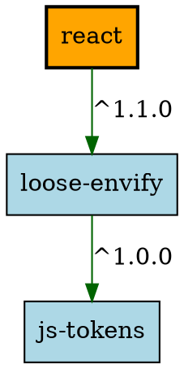

# DependencyGraph - Инструмент визуализации графа зависимостей npm пакетов

## Этап 1: Минимальный прототип с конфигурацией

### Цель этапа
Создание минимального CLI-приложения для визуализации графа зависимостей npm пакетов с настраиваемой конфигурацией через аргументы командной строки.

### Архитектура решения

#### Основной класс
**PackageAnalyzer** - класс предназначенный для обработки конфигурации:
- Парсинг аргументов командной строки
- Валидация параметров
- Обработка ошибок
- Вывод параметров в формате ключ-значение

### Реализованная функциональность

#### Конфигурационные параметры

| Параметр | Тип | Обязательный | Описание |
|----------|-----|--------------|----------|
| `package` | string | Условно | Имя анализируемого пакета |
| `url` | string | Нет | URL репозитория npm |
| `test-repo` | string | Условно | Путь к файлу тестового репозитория |
| `ascii-tree` | boolean | Нет | Режим вывода в формате ASCII-дерева |
| `max-depth` | integer | Нет | Максимальная глубина анализа |

#### Парсинг аргументов
Используется модуль `argparse` для:
- Обработки аргументов командной строки
- Извлечения значений параметров
- Проверки наличия обязательных полей
- Генерации справки

#### Обработка ошибок

| Тип ошибки | Сообщение об ошибке | Причина |
|------------|---------------------|---------|
| Отсутствуют обязательные параметры | `"Необходимо указать либо --package, либо --test-repo"` | Не указан анализируемый пакет |
| Некорректная глубина | `"Максимальная глубина должна быть положительным числом"` | Указана глубина < 1 |
| Некорректный URL | `"URL должен начинаться с http:// или https://"` | Неверный формат URL |
| Файл не найден | `"Файл тестового репозитория не найден: {путь}"` | Указанный файл не существует |

### Пример работы


## Этап 2: Сбор данных

### Цель этапа
Реализовать основную логику получения данных о зависимостях для их дальнейшего анализа и визуализации без использования менеджеров пакетов и сторонних библиотек.

### Архитектура решения

#### Основные методы класса PackageAnalyzer

- `fetch_package_info()` - выполнение HTTP-запросов к npm registry
- `extract_dependencies()` - парсинг JSON-ответов и извлечение зависимостей
- `get_direct_dependencies()` - получение прямых зависимостей пакета
- `load_test_repository()` - загрузка тестовых данных из файла

### Реализованная функциональность

#### Получение данных о зависимостях

- Прямые HTTP-запросы к npm registry API
- Парсинг метаданных пакета
- Извлечение зависимостей из последней версии
- Поддержка `dependencies`, `devDependencies`, `peerDependencies`

#### Формат работы с API npm registry

1. **Запрос метаданных пакета**: `https://registry.npmjs.org/{package_name}`
2. **Извлечение зависимостей**: анализ поля `dependencies` в данных версии

#### Вывод зависимостей


#### Обработка ошибок

| Тип ошибки | Сообщение об ошибке |
|------------|---------------------|
| Пакет не найден | `"Пакет 'non-existent' не найден в репозитории"` |
| Ошибка сети | `"Ошибка подключения: {детали ошибки}"` |
| Ошибка парсинга JSON | `"Ошибка парсинга JSON: {детали ошибки}"` |
| Отсутствуют зависимости | `"Пакет 'package' не имеет зависимостей"` |

---

## Этап 3: Основные операции

### Цель этапа
Построить граф зависимостей (с учетом транзитивности) и выполнить основные операции над ним с использованием алгоритма BFS с рекурсией.

### Выполненные работы

#### 1. Реализация BFS с рекурсией

**Реализация:**
- Создан метод `build_dependency_graph_bfs()` 
- Алгоритм использует рекурсивный обход в ширину с контролем глубины
- Параметр `max_depth` ограничивает глубину анализа

```python
def build_dependency_graph_bfs(self, start_package, current_depth=0, path=None)
```
#### 2. Проведение анализа с учетом максимальной глубины
**Реализация:**
- Параметр `--max-depth` ограничивает глубину рекурсии
- При достижении максимальной глубины обход прекращается
- Значение по умолчанию: 3 уровня

```python
if current_depth >= self.args.max_depth:
    return
```
#### 3. Обработка циклических зависимостей
**Механизм обнаружения:**
- Отслеживание текущего пути обхода
- Вывод предупреждения при обнаружении цикла
- Прерывание рекурсии для данного пути

```python
if start_package in path:
    print(f"⚠️  Обнаружена циклическая зависимость: {' -> '.join(path + [start_package])}")
    self.cycle_detected = True
    return
```
#### 4. Режим тестового репозитория
Формат тестовых данных:
```json
json
{
  "A": ["B", "C"],
  "B": ["D", "E"],
  "C": ["D", "F"],
  "D": ["G"],
  "E": [],
  "F": ["G"],
  "G": []
}
```
#### 5. Демонстрация функциональности
**Тестовые сценарии:**
- Простой граф без циклов
- Граф с ограниченной глубиной
- Пакет без зависимостей
- Граф с циклическими зависимостями

**Примеры использования для этапа 3**
```
# Полный граф зависимостей
python package_analyzer.py --test-repo test_data.json --package A --max-depth 3

# Ограниченная глубина анализа
python package_analyzer.py --test-repo test_data.json --package A --max-depth 1

# Обнаружение циклических зависимостей
python package_analyzer.py --test-repo test_data_advanced.json --package A --max-depth 5

# Реальный пакет с ограничением глубины
python package_analyzer.py --package react --max-depth 2
```

**Вывод графа зависимостей**
```
=== ГРАФ ЗАВИСИМОСТЕЙ ДЛЯ ПАКЕТА 'A' (глубина: 3) ===

📦 A:
   └── B (*)
   └── C (*)

📦 B:
   └── D (*)
   └── E (*)

📦 C:
   └── D (*)
   └── F (*)

📊 Статистика графа:
   - Узлов: 6
   - Зависимостей: 8
   - Циклические зависимости: Нет
```
## Этап 4: Дополнительные операции

### Цель этапа
Выполнить дополнительные операции над графом зависимостей, включая расчет порядка загрузки и сравнение с реальным менеджером пакетов.

### Выполненные работы

#### 1. Режим вывода порядка загрузки зависимостей

**Алгоритм:** Топологическая сортировка (алгоритм Кана)
- Построение графа входящих степеней
- Обработка узлов с нулевой входящей степенью
- Корректная обработка циклических зависимостей

```python
def calculate_load_order(self, start_package):
```

**Реализация:**
- Расчет оптимального порядка загрузки зависимостей
- Учет всех транзитивных зависимостей
- Обработка случаев с циклическими зависимостями

#### 2. Сравнение результатов с реальным менеджером пакетов
**Функциональность:**
- Автоматическое создание временного package.json
- Выполнение команды npm ls для получения реального дерева зависимостей
- Детальный анализ расхождений между нашим расчетом и npm

```python
def compare_with_npm(self, start_package):
def analyze_npm_comparison(self, npm_data, start_package):
```
#### 3. Анализ расхождений в результатах
**Причины возможных расхождений:**

| Параметр | Описание | Влияние на результат |
|----------|----------|----------------------|
| Peer Dependencies | npm учитывает peerDependencies | Наш анализ их игнорирует |
| Dev Dependencies | npm показывает devDependencies | Мы анализируем только runtime зависимости |
| Разрешение версий |  Разные алгоритмы разрешения конфликтов версий | Могут отличаться конечные зависимости |
| Глубина анализа | npm анализирует до бесконечности | Мы ограничены параметром --max-depth |
| Опциональные зависимости | npm учитывает optionalDependencies | Наш инструмент их пропускает |

#### 4. Демонстрация функциональности
**Тестовые сценарии:**

```
# Порядок загрузки для простого графа
python package_analyzer.py --test-repo test_data.json --package A --load-order

# Порядок загрузки с ограниченной глубиной
python package_analyzer.py --test-repo test_data.json --package A --load-order --max-depth 2

# Сравнение с реальным npm (требует Node.js)
python package_analyzer.py --package react --load-order --max-depth 2

# Демонстрация различных случаев
python package_analyzer.py --test-repo test_data_advanced.json --load-order
```
#### 5. Вывод порядка загрузки
```
=== ПОРЯДОК ЗАГРУЗКИ ЗАВИСИМОСТЕЙ ===
Стартовый пакет: A

Порядок загрузки зависимостей:
 1. G
 2. F
 3. E
 4. D
 5. C
 6. B

Финальная загрузка: A
Всего зависимостей для загрузки: 6
```
#### 6. Сравнение с npm выводом
```
🔍 СРАВНЕНИЕ С REAL NPM ДЛЯ ПАКЕТА 'react'
📊 АНАЛИЗ РАСХОЖДЕНИЙ:
   - Зависимостей в npm: 12
   - Зависимостей в нашем анализе: 8
   ❌ Отсутствуют в нашем анализе: ['loose-envify', 'js-tokens', 'object-assign']
   
📝 Причины расхождений:
   - Разные версии пакетов
   - Peer dependencies не учитываются
   - Optional dependencies не учитываются
   - Разная глубина анализа
   - Алгоритмы разрешения зависимостей
```
**Ключевые особенности реализации**
- Топологическая сортировка - гарантирует корректный порядок загрузки
- Обработка циклов - частичный порядок при циклических зависимостях
- Автоматическое сравнение - интеграция с реальной экосистемой npm
- Детальный анализ - объяснение всех расхождений с npm
- Тестовые сценарии - демонстрация различных случаев работы

### Параметры командной строки для этапа 4

| Параметр | Обязательный | Пример | Описание |
|----------|--------------|---------|----------|
| `--load-order` | ❌ | `--load-order` | Включить расчет порядка загрузки |
| `--package` | ✅ | `--package react` | Анализируемый пакет |
| `--max-depth` | ❌ | `--max-depth 3` | Глубина анализа |
| `--test-repo` | ✅ (альтернатива) | `--test-repo data.json` | Тестовый репозиторий |

## Этап 5: Визуализация

### Цель этапа
Получить графическое представление графа зависимостей через текстовое представление и генерацию Graphviz описания.

### Выполненные работы

#### 1. Формирование текстового представления графа

**Формат:** Graphviz DOT language
- Автоматическая генерация описания графа
- Поддержка всех элементов графа зависимостей
- Семантическое оформление узлов и связей

```python
def generate_graphviz_dot(self, start_package):
```
**Особенности реализации:**
- Различное оформление для стартового пакета и зависимостей
- Подписи версий на ребрах зависимостей
- Выделение циклических зависимостей цветом
- Комментарии с метаинформацией о графе

#### 2. Вывод описания графа на языке диаграмм
**Пример Graphviz вывода:**


#### 3. Режим ASCII-дерева
**Алгоритм: Рекурсивное построение иерархического дерева**
- Визуальное представление вложенности зависимостей
- Символы Unicode для отрисовки связей
- Четкая визуальная иерархия

```python
def print_ascii_tree(self, start_package, current_node=None, prefix="", is_last=True):
```
#### Пример вывода ASCII-дерева:

```
🌳 ASCII-ДЕРЕВО ЗАВИСИМОСТЕЙ ДЛЯ: A
==================================================
└── A
    ├── B
    │   ├── D
    │   │   └── G
    │   └── E
    └── C
        ├── D
        │   └── G
        └── F
            └── G
```
#### 4. Демонстрация примеров визуализации
**Тестовые пакеты для демонстрации:**
- Простой граф: Пакет A (линейные зависимости)
- Средняя сложность: Пакет C (множественные зависимости)
- Сложный граф: Пакет E (циклические зависимости)

#### Команды для демонстрации:

```
# ASCII-дерево для тестового репозитория
python package_analyzer.py --test-repo test_data.json --package A --ascii-tree

# Graphviz вывод для реального пакета
python package_analyzer.py --package express --graphviz --output express_graph.dot

# Комбинированная визуализация
python package_analyzer.py --package react --ascii-tree --graphviz --output react_graph.dot

# Демонстрация для нескольких пакетов
python package_analyzer.py --test-repo test_data.json --ascii-tree --graphviz --max-depth 2
```
#### 5. Сравнение с штатными инструментами визуализации
**Метод сравнения:**
- Запуск npm ls для получения эталонного дерева
- Сравнение структуры и количества узлов
- Анализ причин расхождений в визуализации

```python
def compare_with_npm_tree(self, start_package):
def analyze_visualization_differences(self, npm_output, start_package):
```
**Анализ расхождений:**

```
🔍 СРАВНЕНИЕ ВИЗУАЛИЗАЦИИ С NPM ДЛЯ ПАКЕТА 'react'
📊 АНАЛИЗ РАСХОЖДЕНИЙ:
   - Узлов в нашем графе: 8
   - Строк в выводе npm: 15
   
📝 Причины расхождений:
   - npm показывает devDependencies
   - npm включает peerDependencies  
   - npm объединяет дублирующиеся зависимости
   - Разные алгоритмы разрешения конфликтов
```
#### 6. Создание графических представлений
**Инструкция по визуализации:**

```
# Генерация PNG из Graphviz
dot -Tpng express_graph.dot -o express_graph.png

# Генерация SVG (масштабируемый формат)
dot -Tsvg express_graph.dot -o express_graph.svg

# Онлайн визуализация
# Использовать: http://www.webgraphviz.com/
```
### Параметры командной строки для этапа 5

| Параметр | Обязательный | Пример | Описание |
|----------|--------------|---------|----------|
| `--ascii-tree` | ❌ | `--ascii-tree` | Вывод в формате ASCII-дерева |
| `--graphviz` | ❌ | `--graphviz` | Генерация Graphviz описания |
| `--output` | ❌ | `--output graph.dot` | Файл для сохранения Graphviz |
| `--package` | ✅ | `--package react` | Анализируемый пакет |
| `--max-depth` | ❌ | `--max-depth 3` | Глубина анализа |
| `--test-repo` | ✅ (альтернатива) | `--test-repo data.json` | Тестовый репозиторий |
**Ключевые особенности реализации**
- Множественные форматы визуализации - ASCII и Graphviz
- Автоматическая генерация - не требует ручного редактирования
- Семантическое оформление - понятная визуальная структура
- Сравнение с эталоном - валидация корректности результатов
- Экспорт в файлы - сохранение для последующего использования