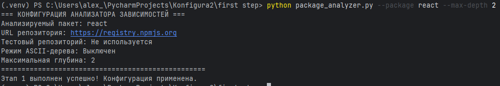
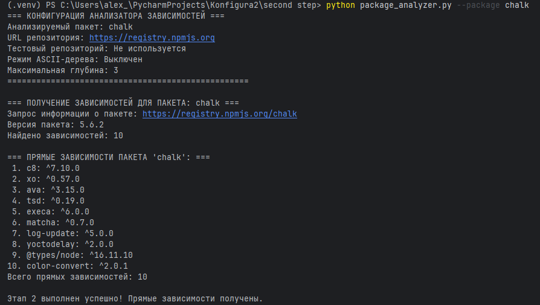

# DependencyGraph - Инструмент визуализации графа зависимостей npm пакетов

## Этап 1: Минимальный прототип с конфигурацией

### Цель этапа
Создание минимального CLI-приложения для визуализации графа зависимостей npm пакетов с настраиваемой конфигурацией через аргументы командной строки.

### Архитектура решения

#### Основной класс
**PackageAnalyzer** - класс предназначенный для обработки конфигурации:
- Парсинг аргументов командной строки
- Валидация параметров
- Обработка ошибок
- Вывод параметров в формате ключ-значение

### Реализованная функциональность

#### Конфигурационные параметры

| Параметр | Тип | Обязательный | Описание |
|----------|-----|--------------|----------|
| `package` | string | Условно | Имя анализируемого пакета |
| `url` | string | Нет | URL репозитория npm |
| `test-repo` | string | Условно | Путь к файлу тестового репозитория |
| `ascii-tree` | boolean | Нет | Режим вывода в формате ASCII-дерева |
| `max-depth` | integer | Нет | Максимальная глубина анализа |

#### Парсинг аргументов
Используется модуль `argparse` для:
- Обработки аргументов командной строки
- Извлечения значений параметров
- Проверки наличия обязательных полей
- Генерации справки

#### Обработка ошибок

| Тип ошибки | Сообщение об ошибке | Причина |
|------------|---------------------|---------|
| Отсутствуют обязательные параметры | `"Необходимо указать либо --package, либо --test-repo"` | Не указан анализируемый пакет |
| Некорректная глубина | `"Максимальная глубина должна быть положительным числом"` | Указана глубина < 1 |
| Некорректный URL | `"URL должен начинаться с http:// или https://"` | Неверный формат URL |
| Файл не найден | `"Файл тестового репозитория не найден: {путь}"` | Указанный файл не существует |

### Пример работы


## Этап 2: Сбор данных

### Цель этапа
Реализовать основную логику получения данных о зависимостях для их дальнейшего анализа и визуализации без использования менеджеров пакетов и сторонних библиотек.

### Архитектура решения

#### Основные методы класса PackageAnalyzer

- `fetch_package_info()` - выполнение HTTP-запросов к npm registry
- `extract_dependencies()` - парсинг JSON-ответов и извлечение зависимостей
- `get_direct_dependencies()` - получение прямых зависимостей пакета
- `load_test_repository()` - загрузка тестовых данных из файла

### Реализованная функциональность

#### Получение данных о зависимостях

- Прямые HTTP-запросы к npm registry API
- Парсинг метаданных пакета
- Извлечение зависимостей из последней версии
- Поддержка `dependencies`, `devDependencies`, `peerDependencies`

#### Формат работы с API npm registry

1. **Запрос метаданных пакета**: `https://registry.npmjs.org/{package_name}`
2. **Извлечение зависимостей**: анализ поля `dependencies` в данных версии

#### Вывод зависимостей




#### Обработка ошибок

| Тип ошибки | Сообщение об ошибке |
|------------|---------------------|
| Пакет не найден | `"Пакет 'non-existent' не найден в репозитории"` |
| Ошибка сети | `"Ошибка подключения: {детали ошибки}"` |
| Ошибка парсинга JSON | `"Ошибка парсинга JSON: {детали ошибки}"` |
| Отсутствуют зависимости | `"Пакет 'package' не имеет зависимостей"` |

---

## Этап 3: Основные операции

### Цель этапа
Построить граф зависимостей (с учетом транзитивности) и выполнить основные операции над ним с использованием алгоритма BFS с рекурсией.

### Выполненные работы

#### 1. Реализация BFS с рекурсией

**Реализация:**
- Создан метод `build_dependency_graph_bfs()` 
- Алгоритм использует рекурсивный обход в ширину с контролем глубины
- Параметр `max_depth` ограничивает глубину анализа

```python
def build_dependency_graph_bfs(self, start_package, current_depth=0, path=None)
```
#### 2. Проведение анализа с учетом максимальной глубины
**Реализация:**
- Параметр `--max-depth` ограничивает глубину рекурсии
- При достижении максимальной глубины обход прекращается
- Значение по умолчанию: 3 уровня

```python
if current_depth >= self.args.max_depth:
    return
```
#### 3. Обработка циклических зависимостей
**Механизм обнаружения:**
- Отслеживание текущего пути обхода
- Вывод предупреждения при обнаружении цикла
- Прерывание рекурсии для данного пути

```python
if start_package in path:
    print(f"⚠️  Обнаружена циклическая зависимость: {' -> '.join(path + [start_package])}")
    self.cycle_detected = True
    return
```
#### 4. Режим тестового репозитория
Формат тестовых данных:
```json
json
{
  "A": ["B", "C"],
  "B": ["D", "E"],
  "C": ["D", "F"],
  "D": ["G"],
  "E": [],
  "F": ["G"],
  "G": []
}
```
#### 5. Демонстрация функциональности
**Тестовые сценарии:**
- Простой граф без циклов
- Граф с ограниченной глубиной
- Пакет без зависимостей
- Граф с циклическими зависимостями

**Примеры использования для этапа 3**
```
# Полный граф зависимостей
python package_analyzer.py --test-repo test_data.json --package A --max-depth 3

# Ограниченная глубина анализа
python package_analyzer.py --test-repo test_data.json --package A --max-depth 1

# Обнаружение циклических зависимостей
python package_analyzer.py --test-repo test_data_advanced.json --package A --max-depth 5

# Реальный пакет с ограничением глубины
python package_analyzer.py --package react --max-depth 2
```

**Вывод графа зависимостей**
```
=== ГРАФ ЗАВИСИМОСТЕЙ ДЛЯ ПАКЕТА 'A' (глубина: 3) ===

📦 A:
   └── B (*)
   └── C (*)

📦 B:
   └── D (*)
   └── E (*)

📦 C:
   └── D (*)
   └── F (*)

📊 Статистика графа:
   - Узлов: 6
   - Зависимостей: 8
   - Циклические зависимости: Нет
```